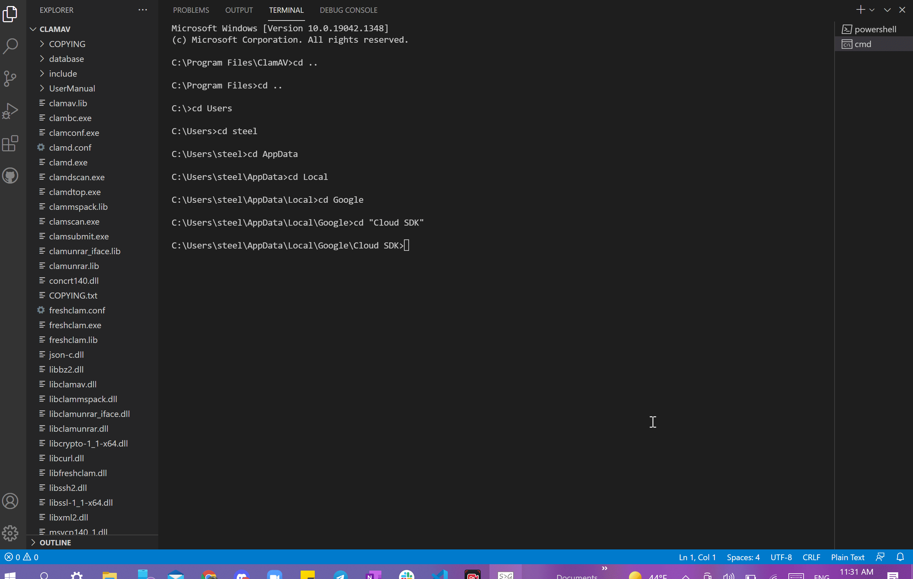
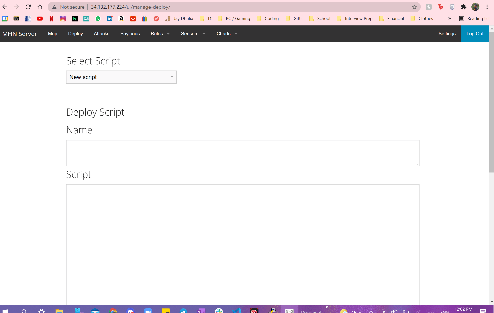
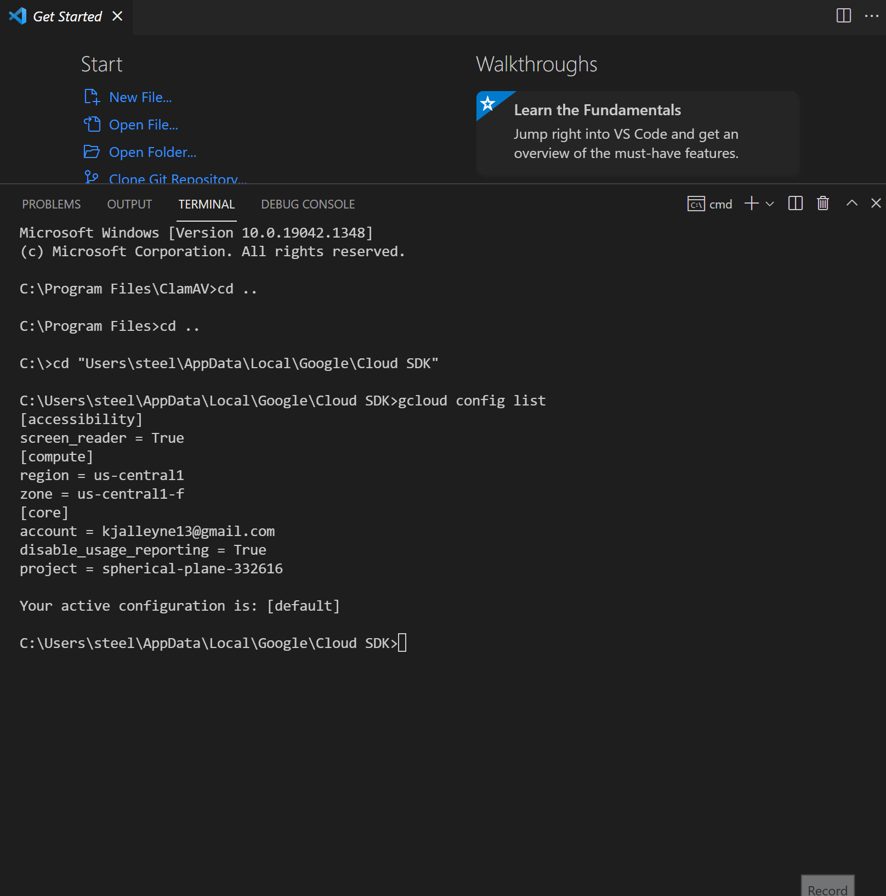
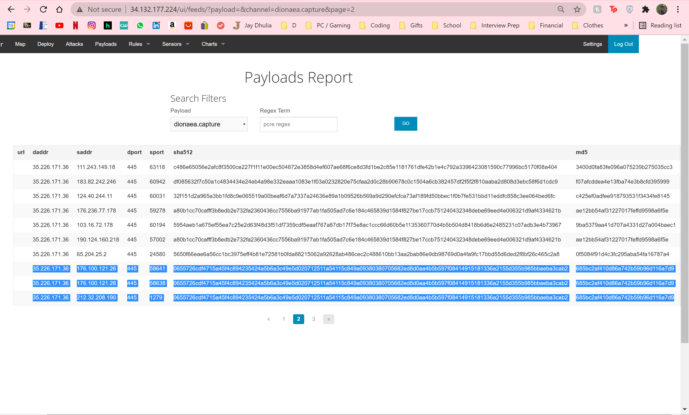
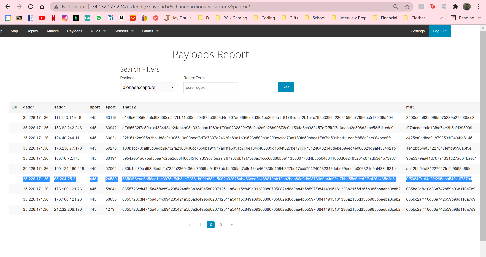
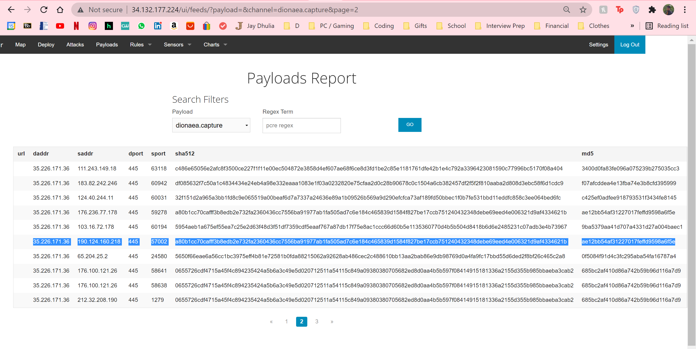

# CodePath-Unit-10-HoneyPot

**Time spent**: 10 hours spent in total

**Objective:** Create a honeynet using MHN-Admin. Present your findings as if you were requested to give a brief report of the current state of Internet security. Assume that your audience is a current employer who is questioning why the company should allocate anymore resources to the IT security team.

### MHN-Admin Deployment 
**Summary:** While I am familiar with VirtualBox and Vagrant, I utilized the GCP service for ease. I downloaded the GCP SDK initialized it and set the default region and zone.
Then I configured the firewall rules for the MHN-Admin with the required inbound ports then I created the VM instance for the MHN-Admin which automatically binds to the premade firewall rules. Finally, I was able to ssh into the VM.

### Dionaea Honeypot Deployment 

**Summary:** Dionaea is a honeypot that was designed specifically to capture payloads & malware samples. To create this VM, most of the previous steps are repeated except, all TCP & UDP traffic are allowed. After ssh into this VM, you can use the deploy command from the MHN server to install the Dionaea software

### Database Backup 

**Summary:** The MHN-Admin uses MongoDB as a RDMS. The JSON file records the honeypot that the attack was directed to, an id number, protocol, timestamp, source ip, source port and destination port.

### Deploying Additional Honeypot

#### Cowrie Honeypot

**Summary:** Cowrie is a honeypot designed specifically for logging brute force attacks while tricking intruders into believing they have Shell access.

### Malware Capture and Identification 

#### Malware #1

**Summary:** This sample was compiled and displayed under the payloads tab in the MHN server. This was found through the Dionaea Honeypot and Yara Hits associate this sample with the YRP/Microsoft_Visual_Cpp_V80_Debug | YRP/Microsoft_Visual_Cpp_80_Debug_ | YRP/Microsoft_Visual_Cpp_80_Debug | YRP/IsPE32 | YRP/IsDLL | YRP/IsWindowsGUI | YRP/HasOverlay | YRP/HasDebugData | YRP/HasRichSignature | YRP/domain | YRP/url | YRP/contentis_base64 | YRP/Browsers | YRP/DebuggerException__SetConsoleCtrl | YRP/anti_dbg | YRP/network_dropper|

MD5 Hash: 685bc2af410d86a742b59b96d116a7d9

SHA1 Hash: 17c237b3bd6b63effa1c309c91f7203300eb07e2

#### Malware #2

**Summary:** This sample was compiled and displayed under the payloads tab in the MHN server. This was found through the Dionaea Honeypot and Yara Hits associate this sample with the FlorianRoth/WannaCry_Ransomware

MD5 Hash: 0f5084f91d4c3fc295aba54fa16787a4

SHA1 Hash: c8eabf2947771941d724128b40e99892f3c65afc

#### Malware #3

**Summary:** This sample was compiled and displayed under the payloads tab in the MHN server. This was found through the Dionaea Honeypot and Yara Hits also associate this sample with the FlorianRoth/WannaCry_Ransomware

MD5 Hash: ae12bb54af31227017feffd9598a6f5e

SHA1 Hash: f597a1cc16d42b7f02e077696e067cd3030a06d9

